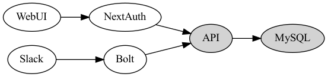

# Scrumbarista

A free alternative for managing your asynchronous standups. In this case here's a free lunch :D

[](https://codecov.io/gh/BailyTroyer/scrumbarista)
[](https://codecov.io/gh/BailyTroyer/scrumbarista)

## Configure Slack API

Once deployed (in k8s or locally) you need to create a bot that's setup with your Slack workspace. This involves creating a slack bot, setting up the outgoing webooks and creating slash commands with proper OAuth permissions.

See [SLACK.md](./docs/SLACK.md) for configuring your app along with the required permissions for Scrumbarista to work with full functionality.

## Project Overview

How and why this is structured this way?

## Running in Kubernetes (Istio)

### Build Docker Images

```bash
$ docker-compose build --pull
$ docker-compose push
```

### Install (Upgrade) Helm Chart

More information on configuring and deploying the helm chart can be found [here](./deploy/README.md).

```bash
$ helm upgrade --install scrumbarista ./deploy --namespace scrumbarista --wait --atomic
```

## Running Locally

All commands can be run locally without docker using node, however its highly recommended to use the node version defined in the Docker
images. If you're using nvm you can simply run `nvm use` to load the nvm version specified in the .nvmrc`.

### Copy the docker-compose

```bash
$ cp docker-compose.yaml docker-compose.override.yaml
```

Make sure to replace all environment variables that have `CHANGE_ME` as the value.

### Build & Run

```bash
$ docker-compose build
$ docker-compose up -d
```

### Run ngrok

```bash
// Here Bolt is running on 3000
$ ngrok http 3000 -region us
```

### Run tests

```bash
// API
$ docker-compose run api npm run test:cov
// Web
$ docker-compose run app npm run test:cov
// Bolt
$ docker-compose run bolt npm run test:cov
```

## Architecture

This codebase follows a "mono-repo" structure but is designed for the API/Bolt/App services to run separately when deployed. They are part of the same `scrumbarista` helm chart, but given a large enough scale could act as completely separate services/repos/teams given the need. That opinion may change over time, but keeping everything in the same repo makes it much easier to maintain in the projects infancy 👶



## Contributing

You may contribute in several ways by creating/proposing new features, fixing bugs, improving documentation and adding more to the README! Find more information in [CONTRIBUTING.md](./CONTRIBUTING.md).
