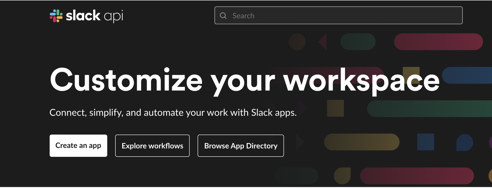

# Creating a Slack bot for Scrumbarista

## Overview

The following guide will outline the steps required to get a slack bot up-and-running in your slack workspace. From here all you need to do is plug the secrets into your local docker-compose (if using ngrok) or override the `values.yaml` in the helm chart.

### 1. Creating a new Slack App

Head over to [api.slack.com](https://api.slack.com/) and **Create an app**:

Select **From Scratch**:

Enter a name and workspace:

### 2. Get Slack Secrets

Once you're inside the slack bot portal, on the left sidebar under **Settings > Basic Information** you will find the **Client Secret** and **Signing Secret** which you'll define in the `docker-compose.override.yaml` or Helm `values.yaml` (these are used to validate incoming requests from slack).

### 3. Configure Slash Commands

On the left sidebar under **Features > Slash Commands** you can setup the slash commands for `/standup`,`/checkin` and `/scrumbarista`.

For each command simply enter the command name and the URL to your running bolt instance (which is either through ngrok on port 3000 or a deployment in k8s):

### 4. Setup OAuth URL & Permissions

On the left sidebar under **Features > OAuth & Permissions** install the app to your workspace and take note of the **Bot User OAuth Token** which will be used in your deployment config. Make sure to enter the redirect URL in the page as well at `URL/slack` where `URL` is the link to the scrumbarista webapp.

Under **Scopes** enter the following scopes:

* `channels:read`
* `chat:write`
* `chat:write.customize`
* `chat:write.public`
* `commands`
* `im:history`
* `im:read`
* `incoming-webhook`
* `users.profile:read`
* `users:read`
* `users:read.email`

These allow both the bolt app and API to read user metadata, authenticate users and properly respond to slash commands + DMs for checkins.

### 5. Enable Subscriptions

On the left sidebar under **Features > Event Subscriptions** enter the URL to your running bolt instance (the same url used for slash commands):

